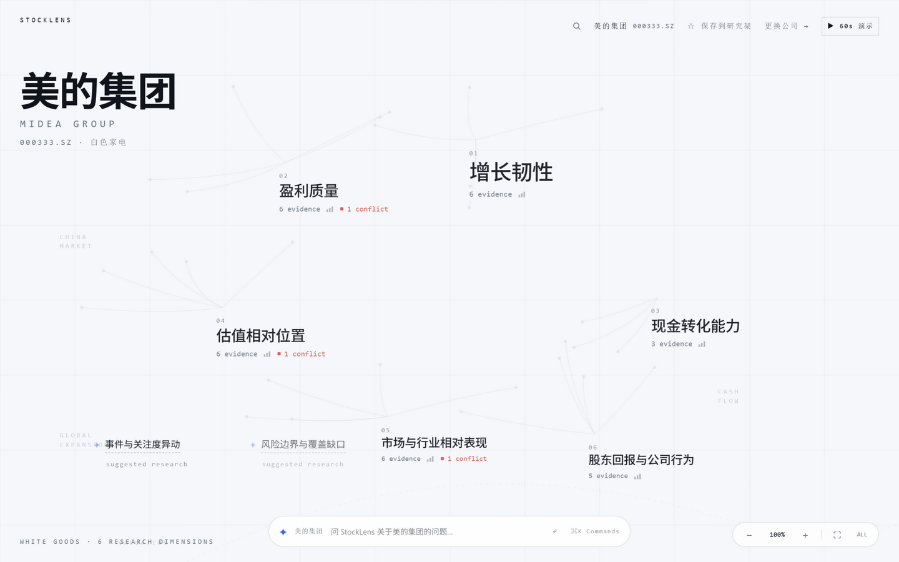
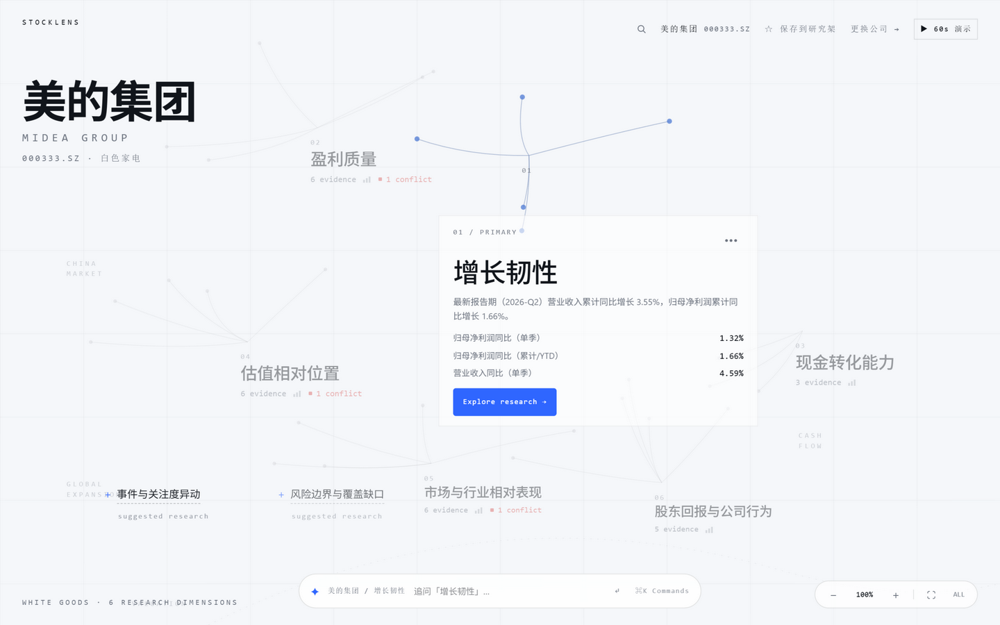
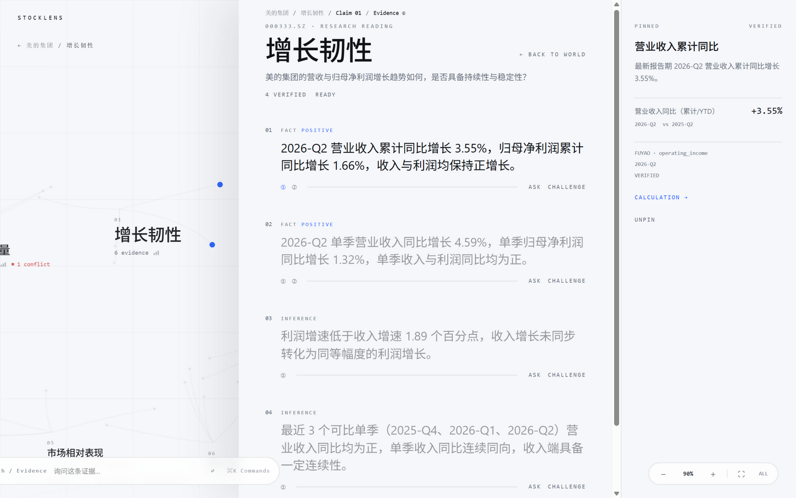
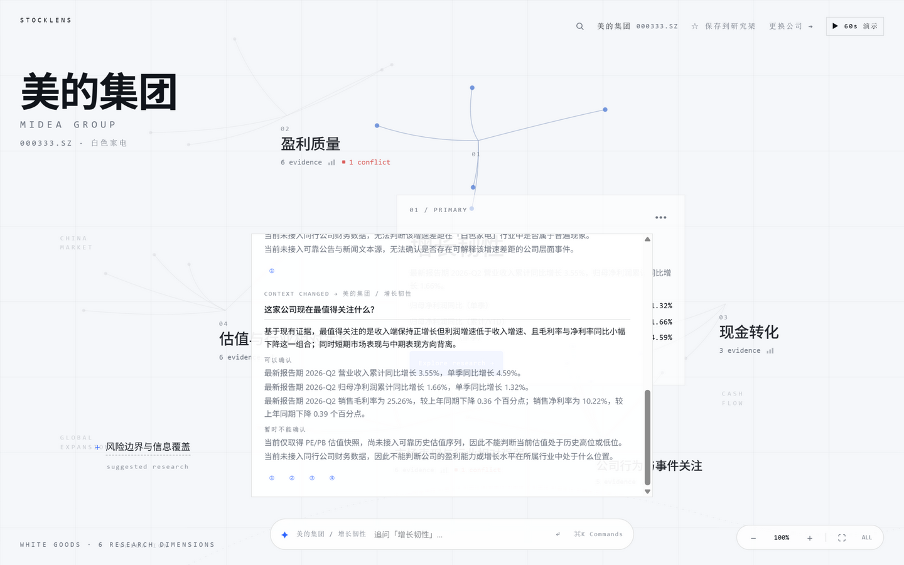
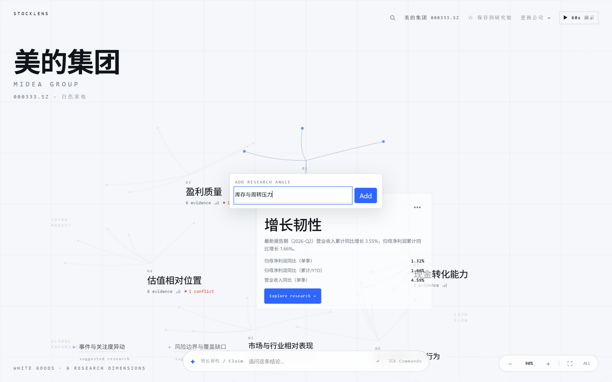
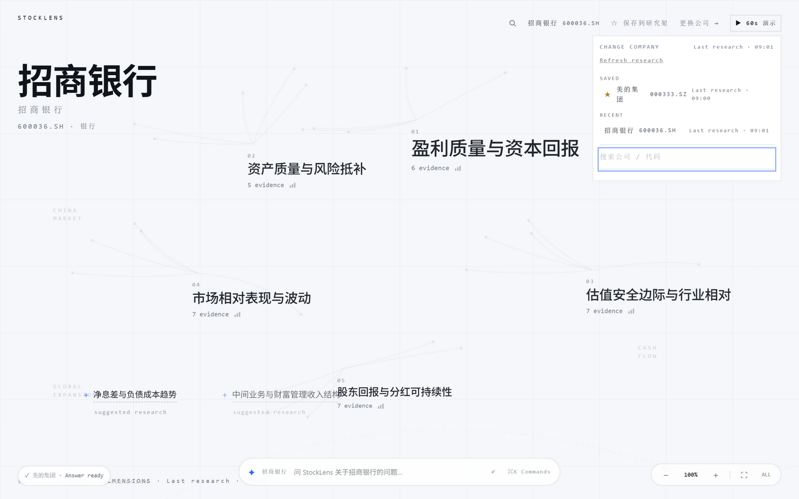

# Product Walkthrough

六张最终截图，全部来自**最终生产构建**（`db618d4`）在 1440×900 下的实拍，干净状态（无调试面板、无失败注入、无 devtools）。每一节说明：用户做什么、为什么这件事重要。

> 这份文档同时是演示视频的备份材料：如果视频交付有问题，评审可以按本文档逐张走完核心链路。

---

## 01 Company Research Canvas

**用户做什么**：打开产品，直接看到美的集团的研究空间。

**为什么重要**：首页不是一张问答框，也不是固定模板的仪表盘。六个研究维度是 AI 依据**公司类型与研究问题**动态命名的（盈利质量 / 增长韧性 / 现金转化能力 / 估值相对位置 / 市场与行业相对表现 / 股东回报与公司行为），每个维度标注了证据条数，出现矛盾的维度带 `1 conflict` 徽标。左下角还有三个「建议研究角度」——它们是依据当前证据结构给出的、尚未展开的方向。

页面没有任何评分、评级或"好/坏"标签。

---

## 02 Focus one research dimension

**用户做什么**：点击「增长韧性」。画布立刻为它让出一块干净空间（其余维度轻量退让），出现 Focus Aperture。

**为什么重要**：这里刻意**不**堆信息——只有一句话摘要、至多三条证据数值、以及唯一的主动作 `Explore research`。摘要本身是推断而非事实（"收入与利润同向但利润弹性偏弱"），所以它必须能被点开验证，这正是下一步。

其余维度在光圈打开时可见地让位（不是被弹窗盖住），空间关系保持可读。

---

## 03 Drill from Claim to Evidence

**用户做什么**：`Explore research` 进入 Reading；每条结论（claim）都标着 `FACT POSITIVE` 或 `INFERENCE`，并带 ①②③ 证据锚点。点击锚点，右侧 Evidence Rail 切到该条证据。

**为什么重要**：这是整个产品的核心承诺——**结论不能停在文字上**。右侧展示的是这一条证据的：结论、指标名称与数值（`营业收入同比（累计/YTD） +3.55%`）、期次与比较期（`2026-Q2 vs 2025-Q2`）、来源（`FUYAO · operating_income`）、校验状态（`VERIFIED`）、以及可展开的 `CALCULATION` 计算口径。同时画布上对应的证据节点被高亮。

事实与推断在这里是**分开标注**的：`FACT` 直接来自数据，`INFERENCE` 是两条以上事实之间的关系判断，可以继续往回溯。

> 顶部依次是研究路径（公司 / 维度 / Claim / Evidence）、报告期与页面标题——三层垂直分层、互不重叠；路径行只在选中结论或证据时出现。若当前证据属于时间敏感数据（行情 / 估值 / 事件核查），证据栏还会多一行「数据截至 YYYY-MM-DD · FRESH / STALE」：判为过期时以 coral 标出，并在结论里强制声明「当前状态无法由该数据确认」。

---

## 04 Ask AI in current context

**用户做什么**：在任意 scope（公司 / 维度 / 单条结论 / 单条证据）下直接提问。截图里刚问过「这家公司现在最值得关注什么？」。

**为什么重要**：AI 的回答**不是自由生成的长文**，而是绑定到已存在的证据，并且主动划出自己的边界——回答分为「可以确认」（逐条列出证据）与「暂时不能确认」（明确写出"当前未接入同行公司财务数据""当前未接入可靠公告与新闻文本源，因此无法确认是否存在公司层面事件影响"）。

这就是这套产品的 AI 纪律：**只解释证据，不生产事实**。线程里 `CONTEXT CHANGED → …` 分隔线记录 scope 变过，历史不被清空，也不暗示模型记得上一轮。

---

## 05 Add a new research angle

**用户做什么**：打开命令面板 → `Add research angle` → 输入自己的研究角度（截图里输入的是「库存与周转压力」）。

**为什么重要**：研究不是沿着系统给定的六条固定路径走完就结束——用户可以把自己的问题加进研究空间。提交后系统会真实判断当前数据能否支撑这个角度：**能支撑的就生成维度，不能支撑的会如实返回 `UNKNOWN` 并列出缺失的数据项**（例如扶摇没有库存字段时，会明确说明证据不完整），而不是编造一段听起来合理的解释。

---

## 06 Save / switch companies

**用户做什么**：把美的集团收藏进研究架（`★ 已保存`），然后切换到招商银行。截图为切换完成后的状态，研究架面板展开（SAVED / RECENT / 搜索）。

**为什么重要**：**不同公司类型得到不同的研究结构**。制造业（美的）得到的是增长韧性、现金转化能力、估值相对位置；银行（招商）得到的是资本回报、资产质量与风险抵补、估值安全边际与行业相对、分红可持续性。这不是换个标签，而是研究框架本身随公司类型改变。

切换过程用全屏研究过渡承载（真实已等待秒数、可随时返回上一家公司），完成后的画布、维度与建议角度全部来自该公司自己的数据。

---

## 一页总结

| 步骤 | 用户价值 |
|---|---|
| 01 研究画布 | 打开即得到一份"这家公司现在该怎么看"的结构，而不是数据堆 |
| 02 Focus Aperture | 从"看标签"变成"进入一个研究问题" |
| 03 Claim → Evidence | 每条结论都能回到指标、期次、单位与计算口径 |
| 04 AI Research Lens | AI 解释证据，并主动声明自己不能确认什么 |
| 05 添加研究角度 | 用户的问题可以进入研究空间；数据不够就诚实返回 UNKNOWN |
| 06 收藏与切换公司 | 研究框架随公司类型改变；研究可以延续而非每次重来 |
